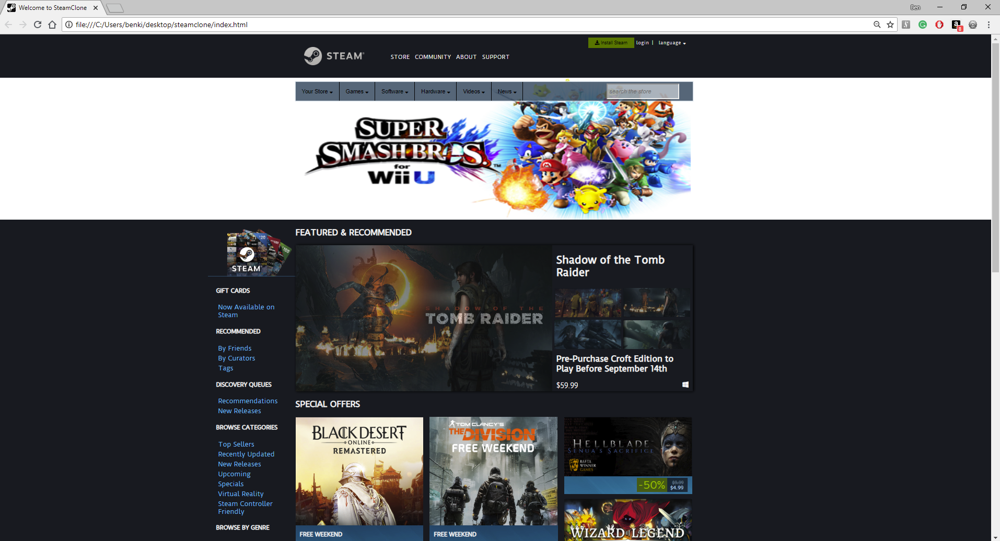

# _Steam Store Clone_

#### _A clone of Steam's landing page, September 2018_

#### By _**Ben Kiggen**_

## Description

_This is unit 2.1's Friday project, a clone of any flex-based-layout site that we fequent._

## Setup/Installation Requirements

See it live @ https://bkiggen.github.io/steamclone

Download it @ https://github.com/bkiggen/steamclone

* Download the .zip file or clone from command line
* open index.html in your chosen browser and/or IDE

## Support and contact details

_For inquiries, issues, or contributions, please contact Ben Kiggen at benkiggen@gmail.com_

## Technologies Used

_This software was created using HTML, CSS, javascript, and jQuery
_

### License

*
License:
MIT license*

Copyright (c) 2016 **_Ben Kiggen_**
